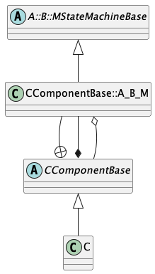

# State Machines

## 1. Introduction

A **state machine** is a software subsystem whose behavior is
described by states and transitions, together with related concepts
such as signals, actions, and guards.
State machines are important in flight software and embedded programming.
In this section, we document the features of F Prime that support
programming with state machines.

## 2. External and Internal State Machines

F Prime supports two kinds of state machines:
**external state machines** and **internal state machines**.
An external state machine is specified by an external tool,
typically the
[State Autocoding for Real-Time Systems (STARS)
tool](https://github.com/JPLOpenSource/STARS/tree/main).
An internal state machine is specified in FPP, the modeling language
for F Prime.

To program with external state machines, you typically do the following:

1. Use an external tool, such as the Quantum Modeler or Plant UML,
to express the state machine.
1. Use the STARS autocoder to generate an implementation from the model.
1. Write a small amount of code to make the FPP model aware of
the implementation.
1. Instantiate the state machine in one or more F Prime components.
1. In the component implementations, write code that interacts with
the state machine instances.

Steps 1, 2, and 5 are described in the STARS documentation.
Steps 3 and 4 are described in the
[_The FPP User's Guide_](https://nasa.github.io/fpp/fpp-users-guide.html).
In the rest of this document, we will focus on the design of internal
state machines.

## 3. FPP Modeling and Code Generation

To work with internal state machines in FPP, you do the following:

1. Define one or more state machines, specifying their behavior.

1. Add one or more instances of the state machines defined in step 1 to a
   component _C_.

1. In the implementation of _C_, write code that interacts with the
generated code for the instances defined in step 2.

Steps 1 and 2 are fully documented in
[_The FPP User's Guide_](https://nasa.github.io/fpp/fpp-users-guide.html).
Here we focus on the generated code for state machines and for
state machine instances.

## 4. State Machine Definitions

In this section we describe the generated code for a state machine definition
_D_ with name _M_.
This code is generated into files _M_`StateMachineAc.hpp` and
_M_`StateMachineAc.cpp`
when you run `fpp-to-cpp` on an FPP model that includes _D_.

In the ordinary way of programming with F Prime, it is unlikely
that you will directly interact with the code described here.
Instead, you will use the component interface to state machine instances
described in the [next section](#state-machine-instances).
Therefore, if your primary interest is to program with F Prime state
machines, you can skip this section.

For examples of generated code, you can do the following:

1. In a local installation of the `fprime` repository, go into `FppTest` and
run `fprime-util generate --ut` and then `fprime-util check`.

1. Look at the FPP models in `fprime/FppTest/state_machine/internal/state`.

1. Look at the generated files in
   `fprime/FppTest/build-fprime-automatic-native-ut/FppTest/state_machine/internal/state`.

<a name="sm-base-class"></a>
### 4.1. The State Machine Base Class

Each state machine definition _D_ in the FPP model becomes a C++ base class
_M_`StateMachineBase`, where _M_ is the unqualified name of the definition.
This class is enclosed in the namespaces, if any, given by the qualified
name of _D_.
For example, a state machine definition whose qualified name is `A.B.M` in FPP
becomes a class `A::B::MStateMachineBase` in C++.
The base class provides a partial implementation which is completed when
the state machine is [instantiated](#state-machine-instances).

<a name="sm-public"></a>
### 4.2. The Public Interface

Each generated state machine has the following public interface.

**Types:**

* There is an enumeration representing the states of the state machine.
These are the leaf states specified in the FPP model
together with a special uninitialized state.

* There is an enumeration representing the signals of the state machine.
These are the signals specified in the FPP model together with a
special signal that represents the initial transition on startup.

**Member functions:**

* There is a function `getState` for getting the current state
of the state machine.

* There is one function `sendSignal` _s_ for each signal _s_
specified in the FPP model.
If the signal _s_ carries a value of type _T_, then this function has one
formal parameter of type _paramType(T)_; otherwise it has no formal parameters.
Here _paramType(T)_ means (1) _T_ if _T_ is a primitive type; otherwise (2)
`const` reference to `Fw::StringBase` if _T_ is a string type; otherwise
(3) `const` reference to _T_.

<a name="sm-protected"></a>
### 4.3. The Protected Interface

**Constructors and destructors:**
There is a zero-argument constructor and a destructor.

**Initialization:**
There is a function `initBase` with a single formal parameter `id`
of type `FwEnumStoreType`.
This function must be called on a state machine instance before
any signals are sent to the instance.
The parameter `id` represents the state machine identifier.
The type is `FwEnumStoreType` because the state machine identifier
type is an enumeration defined in the subclass.

**Actions:**
There is one pure virtual function `action_`_a_ for each action
_a_ specified in the FPP model.
Each action returns `void` has a formal parameter `signal` of type `Signal`.
If the action has a type _T_, then there is a second
formal parameter of type _paramType(T)_.

**Guards:**
There is one pure virtual `const` function `guard_`_g_ for each guard
_g_ specified in the FPP model.
Each guard returns `bool` and has a formal parameter `signal` of type `Signal`.
If the guard has a type _T_, then there is a second
formal parameter of type _paramType(T)_.

**Member variables:**
Each state machine base class has the following member variables:

* A member `m_id` of type `FwEnumStoreType`.
This variable records the current state of the state machine,
represented as `FwEnumStoreType`.
The initial value is zero.

* A member `m_state` of type `State`.
This variable records the current state of the state machine.
The initial value is `State::__FPRIME_AC_UNINITIALIZED`.

### 4.4. The Private Interface

For each state _S_ and choice _C_ in the state machine there is one
entry function for _S_ or _C_.
This function implements the entry behavior for _S_ or _C_
as specified in
[_The FPP Language Specification_](https://nasa.github.io/fpp/fpp-spec.html).


<a name="state-machine-instances"></a>
## 5. State Machine Instances

In this section we describe the generated code for instances of state machines
that are part of a component _C_.
This code is part of the auto-generated base class for _C_.
In general there may be any number of instances of any number
of state machines.

For examples of generated code, you can do the following:

1. In a local installation of the `fprime` repository, go into `FppTest` and
run `fprime-util generate --ut` and then `fprime-util check`.

1. Look at the FPP models in
   `fprime/FppTest/state_machine/internal_instance/state`.

1. Look at the generated files in
   `fprime/FppTest/build-fprime-automatic-native-ut/FppTest/state_machine/internal_instance/state`.

### 5.1. State Machine Identifiers

There is an enumeration `SmId` with numeric type `FwEnumStoreType`
that represents the state machine identifiers.
There is one enumerated constant for each state machine instance
in _C_.

<a name="state-machine-impl"></a>
### 5.2. State Machine Implementation Classes

There is one implementation class for each state machine definition
_M_ that is the type of a state machine instance in _C_.
For example, if a state machine instance
```
state machine instance m: M
```
appears in the definition of _C_, then the auto-generated base
class for _C_ contains an implementation class for _M_.
This class has the following properties:

* It is a protected inner class of the auto-generated base class for _C_.

* Its name is the fully qualified name of the state machine,
converted to a C++ identifier by replacing the dots with underscores.
For example, if a state machine has name `A.B.M` in FPP,
the C++ name of its implementation class is `A_B_M`.
We will refer to this name as _fqCppIdent(M)_.

* It is a public derived class of the [state machine base
class for _M_](#sm-base-class).

The following class diagram shows these properties, for a state
machine `A.B.M` instantiated in a component `C`:



Each state machine implementation class has the following
elements in its interface.

**Member variables:**
There is a member `m_component` that is a reference to
the enclosing component instance.
This way the state machine instance can call into
the interface of the component instance.

**Construction:** There is a public constructor
that takes a reference `*this` to the enclosing component
as an argument.
It initializes the member variable described above.

**Initialization:** There is a public function
`init` with one formal parameter `smId` of type `SmId`.
This function casts its argument to `FwEnumStoreType`
and calls the function `initBase` defined in the base class.
Thus it provides a type-safe way to initialize the state
machine ID.

**State ID:** There is a public function `getId`
that returns the state machine ID.
It gets the value out of the `m_id` field defined
in the base class and casts it to `SmId`.
Thus it provides a type-safe way to get the state
machine ID.

**Actions:** For each action _a_ of _M_, there is one private function that
implements the [pure virtual function for _a_ defined in the base
class for _M_](#sm-protected).
The implementation calls the [pure virtual function in the bass class for _C_
that corresponds to to _M_ and _a_](#component-pure-virtual).
It passes in the state machine ID of `*this`.

**Guards:** For each guard _g_ of _M_, there is one private function that
implements the [pure virtual function for _g_ defined in the base
class for _M_](#sm-protected).
The implementation calls the [pure virtual function in the base class for _C_
that corresponds to to _M_ and _g_](#component-pure-virtual).
It passes in the state machine ID of `*this` and returns the Boolean value returned
by that function.

### 5.3. State Machine Instance Variables

For each state machine _m_ in the FPP component model, there is
one private member variable `m_stateMachine_`_m_.
Its type is the [state machine implementation class](#state-machine-impl)
corresponding to the state machine _M_ instantiated by _m_.

### 5.4. State Machine Initialization

When a component _C_ instantiates one or more state machines,
the standard _init_ function of _C_ calls the _init_ function
on each state machine instance, passing in the enumerated
constant for each state machine ID.
In the standard sequence for F Prime FSW initialization,
the _init_ function is called before any component instances
are connected.
Therefore, the initial transition of any state machine,
including any entry actions of the initial state, may
not emit events or telemetry or invoke any output port.
If you need to emit events or telemetry or invoke an output port
at the start of steady-state execution, you can have the
initial state be a state _INIT_ that does nothing but transition to another 
state _START_ on an RTI signal.
When the component instance receives an RTI call on its `schedIn` port,
it can send the RTI signal to the state machine, causing
the transition to _START_.
At this point the components are connected, and the transition
to _START_ can emit events or telemetry or invoke an output port.

### 5.5. Protected Member Functions

The auto-generated base class for _C_ has the following protected functions.

#### 5.5.1. Implemented Functions

The following functions have complete implementations.
They are available to call in the derived class that implements _C_.

**State getter functions:**
For each state machine instance _m_ in _C_, there is a `const` function
_m_`_getState` that gets the current state of _m_.

**Signal send functions:**
For each state machine instance _m_, and for each signal _s_ defined
in the state machine _M_ instantiated by _m_, there is a function
_m_`_sendSignal_`_s_ for sending _s_ to _m_.
If _s_ carries data of type _T_, then this function has a single
formal parameter of type [_paramType(T)_](#sm-public); otherwise it has no
formal parameters.

Calling a signal send function puts a message on the queue of the
current instance of the component _C_.
When the message is dispatched, the auto-generated code calls
the function that sends the signal to the state machine.
This way state machines can safely send signals when they
are doing actions.

Each send signal function does the following:

1. Call [`sendSignalStart`](#component-private) to begin constructing a message
   buffer _B_.

1. If the signal carries data, then serialize the data into _B_.

1. Call the appropriate [`sendSignalFinish`](#component-private) function to
put _B_ onto the component queue and handle overflow.

<a name="component-pure-virtual"></a>
#### 5.5.2. Pure Virtual Functions

The following functions are pure virtual in the generated base class for _C_.
You must implement them in the derived class that implements _C_.
When you generate a C++ component implementation template for _C_, you get
a stub for each of these functions that you can fill in.

**Action functions:**
For each state machine _M_ instantiated in _C_, for each action _a_
specified in _M_, there is a pure virtual function _fqCppIdent(M)_`_action_`_a_.
Recall that _fqCppIdent(M)_ is the fully qualified name of _M_ represented
as a C++ identifier, i.e., the fully qualified name of _M_ in FPP with
the dots replaced by underscores.
This function has at least two formal parameters: the state machine ID
and the signal.
If the action requires a value of type _T_, then there is a third
formal parameter of type [_paramType(T)_](#sm-public).

When an instance _m_ of _M_ does action _a_, it calls the action function
for _a_ in the [auto-generated base class of _M_](#state-machine-impl).
That function calls _fqCppIdent(M)_`_action_`_a_ with the correct state machine
ID, signal, and value, if any.

**Guard functions:**
For each state machine _M_ is instantiated in _C_, for each guard _g_
specified in _M_, there is a pure virtual function _fqCppIdent(M)_`_guard_`_g_.
This is a `const` function that returns `bool`.
It has the same formal parameters as an action function that requires the same
value type, if any.

When an instance _m_ of _M_ evaluates guard _g_, it calls the guard function
for _g_ in the [auto-generated base class of _M_](#state-machine-impl).
That function calls _fqCppIdent(M)_`_guard_`_g_ with the correct state machine
ID, signal, and value, if any, and returns the resulting Boolean value.

**Overflow hook functions:**
For each state machine instance _m_ that has overflow behavior `hook`,
there is a pure virtual function _m_`_stateMachineOverflowHook` with
the following formal parameters: the state machine ID,
the signal, and a reference to the message buffer.
The deserialization pointer of the message buffer points to the start
of the message data, so the data can be deserialized if needed.
If the signal that caused the overflow carries no data, then the
deserialization pointer is at the end of the buffer, and deserializing
data from the buffer will return a `BUFFER_EMPTY` error.

<a name="component-private"></a>
### 5.6. Private Member Functions

The generated base class for _C_ has the following private member functions.

**Send signal helper functions:**

* A function `sendSignalStart`.
Each send signal function calls this function to begin
constructing a message buffer for sending a state machine signal.
This function serializes the following data into the message buffer:
message type, the port number, the state machine ID, and the signal.

* For each state machine instance _m_, a function _m_`_sendSignalFinish`.
This function puts the message buffer on the queue with the correct
priority and overflow behavior for _m_.

**Helper functions for state machine dispatch:**

* A function `smDispatch` for initial dispatch of a state machine
signal message from the queue.
This function does the following:

  1. Call `deserializeSmIdAndSignal` to deserialize the state machine ID and
     signal from the message buffer as `FwEnumStoreType` values.

  1. Cast the state machine ID to `SmId` and use it to select the
     target state machine instance _m_.

  1. Cast the signal to the appropriate type for _m_.

  1. Call the appropriate `smDispatch` helper for the state machine _M_ of
     which _m_ is an instance, passing the message buffer, a reference to
     `m_stateMachine_`_m_, and the signal.

* A function `deserializeSmIdAndSignal` for deserializing the state
  machine ID and signal from the message buffer as `FwEnumStoreType` values.

* For each state machine _M_ that is instantiated in _C_, a function
  _fqCppIdent(M)_`_smDispatch` for finishing the dispatch of a signal to a
state machine instance of type _M_.
  It takes as arguments the message buffer _B_, a reference _sm_ to a state
machine instance, and a signal _s_.
  It deserializes the data from _B_ if there is any for _s_.
  Then it calls _sm_`.sendSignal_`_s_, passing in the data, if any.
