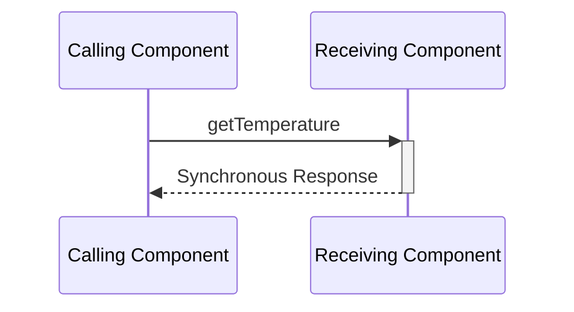
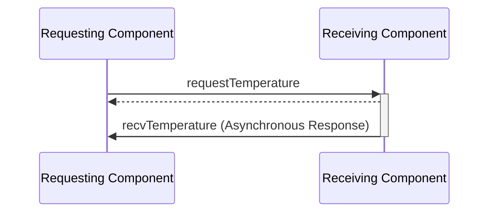
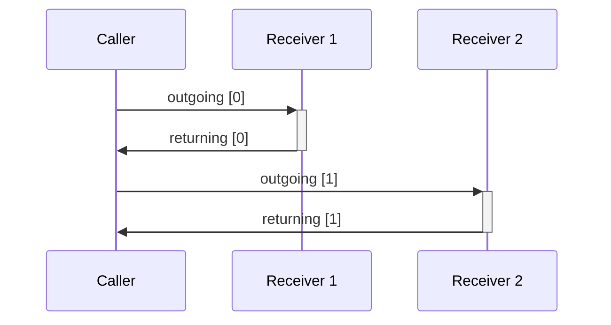
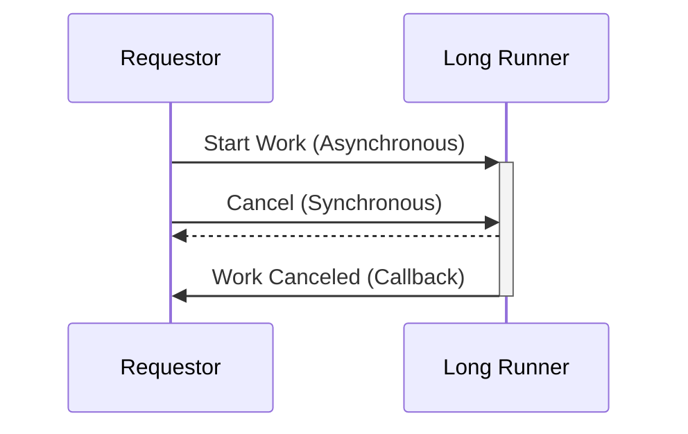

# Common Port Design Patterns

This guide will walk you through several common patterns using [ports](../overview/port-comp-top.md#ports-f-communication) in F Prime. 

You should be familiar with [Ports, Components, and Topologies](../overview/port-comp-top.md) in F Prime as well as have a basic understanding of modeling in [FPP](https://nasa.github.io/fpp/fpp-users-guide). To build an understanding of these concepts, you should consider running through our [Hello World Tutorial](https://fprime.jpl.nasa.gov/latest/tutorials-hello-world/docs/hello-world/).

**Common Port Patterns:**
1. [Synchronous Get Ports](#synchronous-get-ports)
2. [Callback Ports](#callback-ports)
3. [Parallel Ports](#parallel-ports)
4. [Synchronous Cancel](#synchronous-cancel)

## Synchronous Get Ports

Synchronous get ports are used to return data immediately from a component. These ports allow for the immediate query of data between components in an F Prime topology.

These ports can provide function-call like behavior between components that are connected together in an F Prime topology while still working within the bounds of the F Prime component architecture.

An example of synchronous get ports can be seen in the [PrmDb component](https://github.com/nasa/fprime/blob/devel/Svc/PrmDb/PrmDb.fpp#L42-L43).



> [!WARNING]
> When the value needed requires non-trivial work to compute a [Callback Port](#callback-ports) should be used instead.

Synchronous get ports maintain the architectural distinction between components while facilitating the return of data possible like in a standard function call. However, since these port calls execute on the thread of the caller, they should not perform substantial work as that would slow down the calling component..

Synchronous get component port instances typically use a name of the form "get<Value>" to designate their function (e.g. getTemperature).

> [!NOTE]
> Ensuring the work performed when in the synchronous handler is as minimal as possible is crucial to prevent delays from propagating back to the caller.

### Implementation

Synchronous get ports are implemented using a port type with a return value:

```fpp
@ Port synchronously returning an F32
port GetMyF32() -> F32
```

Component implementations will use a port instance of either of the synchronous port [kinds](https://nasa.github.io/fpp/fpp-users-guide.html#Defining-Components_Port-Instances_Basic-Port-Instances) (`sync` or `guarded`) and the "get" naming scheme described above.

```fpp
component MyComponent {
    guarded getTemperature: GetMyF32
}
```

Finally, the port handler should be minimal often returning just returning the value of a member variable previously set.

```c++
F32 getTemperature_handler() {
    return this->m_previously_set_temperature;
}
```
> [!NOTE]
> This snippet used the `guarded` kind to ensure data member protection provided through the `guarded` port's mutex.

### Conclusion

Synchronous get ports are used to return values from one component in the F Prime topology to another when little or no work is necessary to produce that value.


## Callback Ports

The callback port patten is used to separate a request port invocation from a following response port invocation allowing the requestor to return to other work while the request is completed. The ports used may be of any type and may contain port arguments to communicate results.

An example of this pattern can be found as part of the [Manager/Worker](https://github.com/fprime-community/fprime-examples/tree/devel/FlightExamples/ManagerWorker) interaction seen in F Prime examples.



Callback ports use two port connections between two components. The first port connection is an output port from the requester and an input to the receiver. The second port is an output of the receiver and an input back to the requester.

Command dispatch in F Prime uses the callback pattern.  The command dispatch port is invoked from the dispatcher (callback requester) to a component (callback receiver). The component will callback using the command completion port sending the success/failure status of the command execution.

Callback port instances receiving the results of a request should distinguish themselves from synchronous get ports by using naming of the form "recv<Value>".

Callback ports can be of any instance kind (`sync`, `guarded`, `async`) but are most commonly seen with `async` request ports as these cannot return a value upon invocation like synchronous get ports.

### Implementation

The requestor side of the callback port patten instantiates an `output` request port instance of any port type, and an `input` receive port instance of any type.  In the example below, `Fw.Signal` is used as the request type, and response port types, however; any port type may be used.

```fpp
component MyRequestor {
    @ Start long-running request
    output startRequest: Fw.Signal

    @ Receive data from long-running request
    guarded input recvResponse: Fw.Signal
}
```

The receiver contains the same ports with opposing directions. 

```fpp
component MyReceiver {
    @ Start long-running request
    async input startRequest: Fw.Signal

    @ Send data from long-running request
    output sendResponse: Fw.Signal
}
```

Finally, in the system topology the two component instances are cross-connected.

```fpp
connections CallbackPattern {
    requestor.startRequest -> receiver.startRequest
    receiver.sendResponse -> requestor.recvResponse
}
```

### Conclusion

The callback port patten is used to separate a request from the response allowing the requestor to return to other work while the request is completed.

## Parallel Ports

Parallel ports are can be used to manage a set of [callback ports](#callback-ports) and other sets of ports that attach to a set of external components. The advantage of the parallel port pattern is that it makes managing the call-response across this set of components easier by ensuring that ports are treated as parallel arrays. FPP modeling provides checks for parallel ports as well.

An example of parallel ports is the [Command Dispatcher](https://github.com/nasa/fprime/blob/875fa11f07480bd966bb9fd209c75534306f7572/Svc/CmdDispatcher/CmdDispatcher.fpp#L36) where `compCmdSend` is parallel to `compCmdReg` allowing correlation between command sending and registration.



By connecting a given component from the set of external component using the same index across ports the source component implementations can correlate the messages by port index.

### Implementation

In order to implement the parallel-port pattern, the user should define the ports using like-sized port arrays.  Parallel ports may use any kind of port (`sync`, `async`, `guarded`) and any port types as long as the port instance are arrays of the same size. It is best practice to define a constant to hold the dimension of the parallel port array.

The FPP modeling language provides a mechanism to automatically check parallel ports. This is called [matched ports](https://nasa.github.io/fpp/fpp-users-guide.html#Defining-Components_Matched-Ports). Using `match` and `with` you can establish a parallel relationship between two port arrays. This will yield an error if matched ports are not hooked up in parallel.

In the snippet below, we implement outgoing/incoming ports using parallel ports.

```
@ Parallel Port Array Count
constant PARALLEL_PORT_COUNT = 10

@ Outgoing parallel port
output port outgoing: [PARALLEL_PORT_COUNT] Fw.Signal

@ Incoming Parallel Port
async input port incoming: [PARALLEL_PORT_COUNT] Fw.Signal

@ Establish a model-checked parallel relationship
match incoming with outgoing
```

In the system topology, components should be wired to the same port index on the outgoing and incoming sides. 

```
connections ParallelPorts {
    myComponent.outgoing[0] -> comp0.in
    myComponent.outgoing[1] -> comp1.in

    comp0.out -> myComponent.incoming[0]
    comp1.out -> myComponent.incoming[1]
}
```

Notice how `comp0` in this snippet is is wired to `myComponent`'s ports always using the 0th index. The same is true for `comp1` on the 1st index. This allows the component to correlate the remote component via index.

In the C++ implementation this would look like:

```c++
    // Send a message to comp0
    this->outgoing_out(0);
    // Send a message to comp1
    this->outgoing_out(1);

void incoming_handler(FwIndexType portIndex) {
    switch (portIndex) {
        case 0:
            // Handle message from comp0
            break;
        case 1:
            // Handle message from comp1
            break;
    }
}
```
> [!NOTE]
> `comp0` and `comp1` could be any components. The important part is that a given component's ports (outgoing and incoming in this example) always use the same index for the same remote component.

### Conclusion

Parallel ports are useful in correlating port calls to a set of components using the port index. Parallel ports can be automatically checked using `match A with B` syntax in FPP.

## Synchronous Cancel

The synchronous cancel pattern is used to stop work running inside an asynchronous port handler.

Asynchronous components performing long-running work inside an `async` port handler or `async` command handler may need to stop that work before it has completed. However, another `async` message would be queued behind the long-running work and would be unable to halt the ongoing work.

This situation can be remedied by using a `sync` port call to set a cancel flag, which the long-running work can poll to determine if the work should be stopped early.

An example of this pattern can be found as part of the [Worker Component](https://github.com/fprime-community/fprime-examples/tree/devel/FlightExamples/ManagerWorker/Worker) in F Prime examples.



> [!NOTE]
> This pattern works equally well with `sync` commands allowing ground operators and sequences to cancel long-running work instead of other components.

> [!NOTE]
> The thread invoking cancel and the thread performing work are on different threads. Cancel flags or other shared data items must be operated on atomically.

### Implementation

Implementation of this pattern requires a synchronous port, perhaps using the `Fw.Signal` type:

```fpp
@ Port used to cancel long-running work
sync input port cancel: Fw.Signal

@ Example port performing long-running work to be canceled
async input port exampleRun: Fw.Signal
```

The component implementation class must provide a member variable (or other mechanism) to set synchronously when cancel is invoked. Here we use `std::atomic` to guarantee atomicity, however; a plain member variable could also be used in conjunction with `Os::Mutex` to also ensure atomicity.

```cpp
#include <atomic>

class MyComponent {
    ...
  private:
    std::atomic<bool> m_cancel;
}
```

The port handler of the cancel port then atomically sets a cancel flag to indicate that the long running work should stop.

```cpp
void cancel_handler() {
    // std::atomic ensures an atomic set of the cancel flag
    this->m_cancel = true;
}
```

Finally, the long-running work must occasionally poll to see if cancel is set.  This is shown below using a `while` loop .  Again, use of `std::atomic` or `Os::Mutex` is critical to ensure this read (and the above write) are safe as the read/write occur on different threads.


```cpp
void exampleRun_handler() {
    // Reset cancel flag before doing work
    this->m_cancel = false;

    // Loop until the work is done or the cancel request was received
    while (not work_done && not this->m_cancel) {
        ... do work ...
    }
}
```

### Conclusion

The synchronous cancel  pattern is used to stop work running inside an `async` handler. It is performed by atomically setting a cancel flag in a `sync` handler and polling that flag during the work running in the `async` handler.

## Conclusion

You should now be able to understand and apply common port patterns in F Prime.
