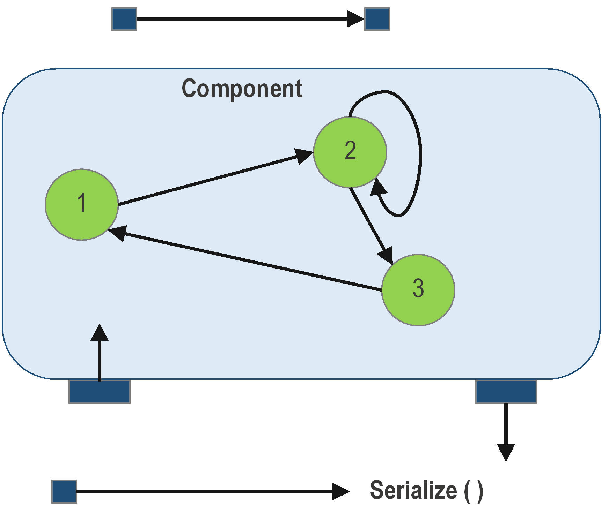
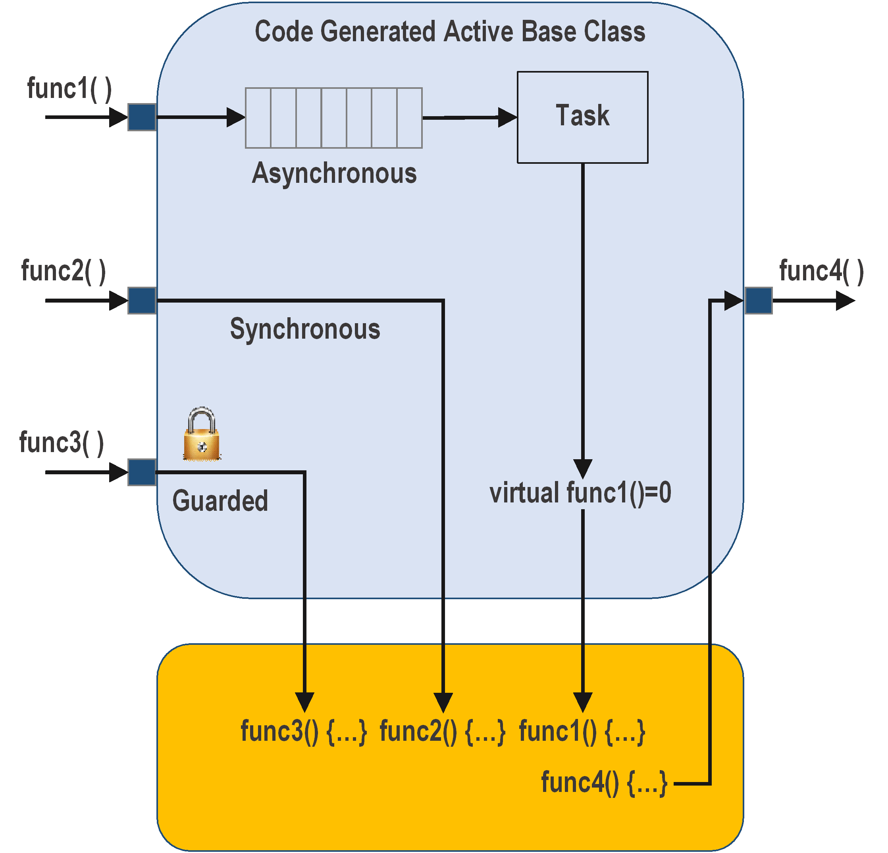
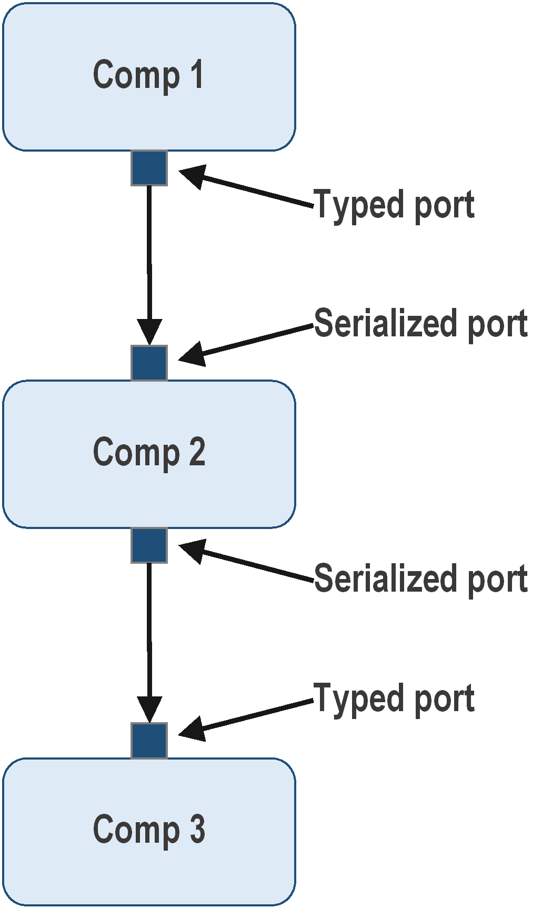
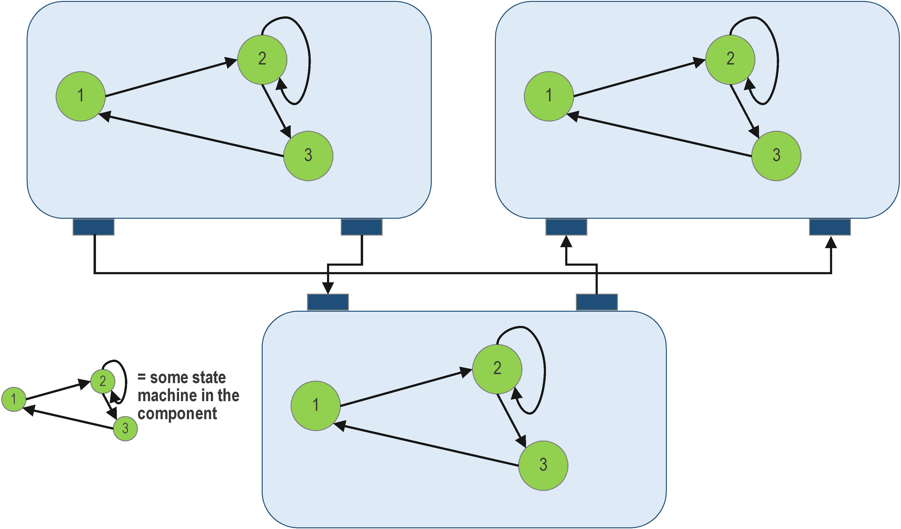
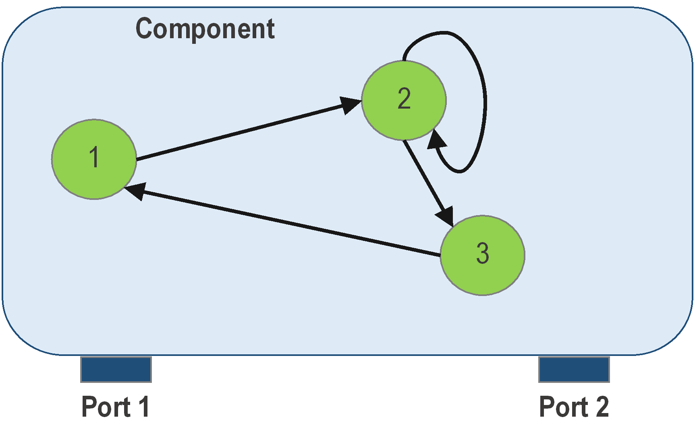
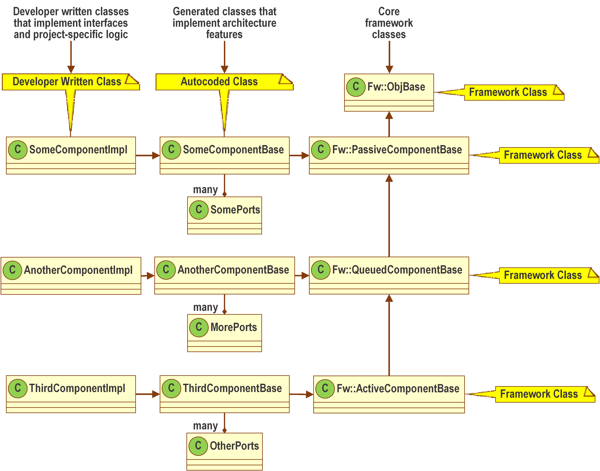
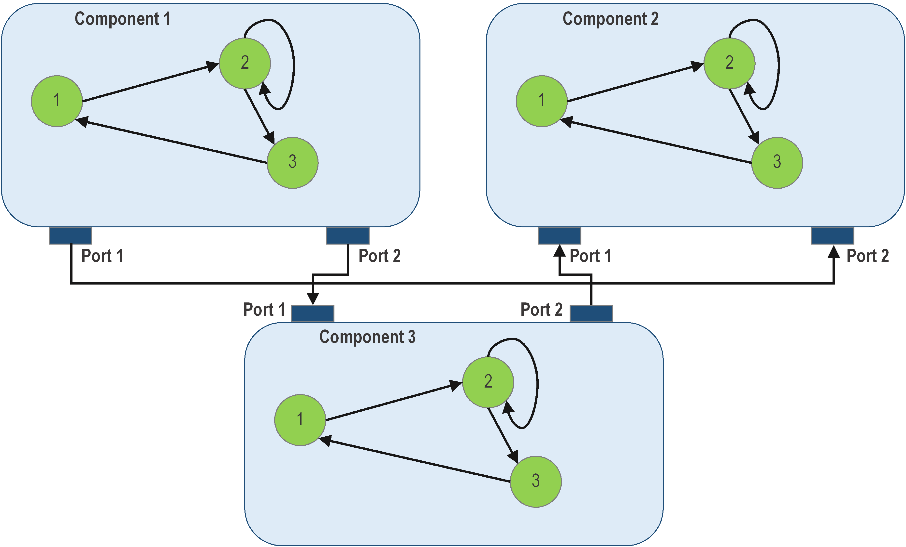

# Core Constructs: Ports, Components, and Topologies

**Ports**, **Components**, and **Topologies** represent the building blocks of an F´ system.  From these pieces, a
modular system is constructed to complete the objective of the embedded system. This document includes:

- [Ports: F´ Communication](#ports-f-communication)
- [Components: F´ Modules](#components-f-modules)
- [Topology: F´ Application](#topology-f-application)
- [Conclusion](#conclusion)

## Ports: F´ Communication

Although F´ is primarily decomposed into a set of **Components**, it is often the port that a user of F´ must
understand first. This is because the set of ports a **Component** defines is the external (or public) interface of
that **Component** in an F´ system. Thus it is essential to understand and design these **Ports** correctly.

### Port Characteristics

Ports are the point of interconnection between **Components** in the software framework and encapsulate typed interfaces
in the architecture. This means that each port definition is of a specific type (e.g. CommandDispatchPort) and can only
connect **Components** defining ports of the same type. When one **Component** uses a port to communicate with another
**Component** this action is called a port **invocation**. These port types are known as "data_types" because they
represent the data being conveyed across the port.

A port supports passing arguments across the port's connection in order to pass data to the receiving
**Component** of an invocation. Some ports may also return data from the receiving **Component** to the invoking
**Component**. A port may specify zero or more arguments of any F´ data type or primitive (int, float, U8, etc.).
Pointers and references are allowed as arguments to the port as well (for performance purposes), but care should be
taken to ensure correct memory management as the ownership of the underlying memory is effectively shared when the
port is invoked.  The port's type is synonymous with the port invocations' "data_type" when used on a **Component**.

When using a port, the user specifies directionality. It can represent an input or an output. This direction
pertains to the direction of invocation from one originating **Component** to another and not necessarily the direction
of data flow i.e. output ports (invoking out to another **Component**) can in some cases retrieve data. Multiple output
ports can be connected to a single input port implying that at **Component** responding to a port invocation could be
responding to one of a set of invoking **Components**. **Caution:** a single output port can be connected to only one
input port at a time.

Another aspect of port usage is the synchronous/asynchronous nature of the port. A synchronous port operates like a
function call running in the execution context of the invoking **Component** (i.e. on the invoker's Thread). The
synchronous nature of the port along with the directionality is combined in the "kind" when used by the **Component**.

Finally, a port can be defined as "guarded", which means invocations into the port are limited to a single invocation
at a time by a component-wide mutex. This is also combined into the "kind" attribute.

**Figure 1. Port connectivity.** Ports are connected to ports of the same type. When used by a *component*, the ports
can define directionality. Using *serialized ports* (see below), serializes the call and passes it to a data buffer
such that it can be sent and deserialized anywhere.

When discussing ports, one must be careful to distinguish between the port **design** and the port instantiation.  A
port's design is generic specifying its type (name, arguments transported, etc) and when used in a **Component** is
designated as the port's "data_type". The design is careful not to specify its usage by a component (directionality,
synchronous/asynchronous nature, guarded/not guarded). This is specified as part of the instantiation of a port when
used by a component. This instantiation is specifically part of the **Component**'s design and not the port's
design and is known as the "kind" of port's instantiation.

### A Quick Look at Port Kinds Defined in A Component's Usage

| Port Kind | Direction | Synchronous / Asynchronous | Guarded | May Return Data | See Diagram | Notes |
|---|---|---|---|---|---|---|
| output | out | | | | `func4()` | The input side of a connection defines all port properties.|
| sync_input | in | synchronous | no | yes | `func2()` | |
| async_input | in | asynchronous | no | no | `func1()` | |
| guarded_input | in | synchronous | yes | yes | `func3()` | Guarded ports by definition must be synchronous |

> [!NOTE]
> A port's type (aka data_type) is dependent on the design and usage in the deployment.

**Figure 2. Port Kinds Used on a Component.** For the *synchronous port*, the call directly invokes derived functions
without the use of a queue. For a *guarded port*, the call directly invokes derived functions, but only after locking a
mutex shared by all guarded ports in the component. For an *asynchronous port*, the call is placed in a queue and
dispatched on a thread that empties the queue.

Should the user wish to understand what types of ports are available per component type, please review the section on
[Port Kinds Available to Each Component Type](#port-kinds-available-to-each-component-type)

### Port Call Serialization

Serialization on ports take arguments supplied to the port and translates them to a data buffer. The serialized ports
are supported by the framework allowing users to send primitive and custom types. Ports can have return valves; however,
use is limited to only return data when the component has defined the input port (invoked port) as a synchronous
interface, and the port serialization has been disabled since serialization passes a data buffer without returning one.

Serialization takes a specific set of typed values or function arguments and converts them in an
architecture-independent way translating them to a data buffer. A port call’s commands and arguments are serialized and
placed on message queues in the receiving component. In addition command arguments and telemetry values are passed as
serialized buffers so that components that transfer the data can be independent of the definition of the data.

Users can define arbitrary interface argument types and the framework automatically serializes the data for port calls.
They can also define complex types in FPP where a code generator generates classes that are serializable for use
internally, and usable with the F´ supplied ground system.

### Special Serialized Ports

Serialization ports are special ports that handle serialized buffers without automatically unpacking them. Any output
port type can connect to a serialization port input type, and any serialization output port can be connected to any
input port type. This allows strongly-typed ports to connect to generic "pass-any-data" serialization ports as shown
in Figure 3. For input ports, the calling port detects a connection and serializes arguments. For the output ports,
the serialized port calls an interface on the typed port that deserializes arguments. Serialization ports do not support
ports with return types. These ports allow serialized data to be passed around by generic components that do not know
the type contained. The [Hub pattern](../design-patterns/hub-pattern.md) often uses serialized ports such that data can be routed
across an address-space gap in a generic fashion.

**Figure 3. Serialization ports.** Input ports input the serialized buffer, while the output ports output
the serialized buffer.

Serialization ports are useful for generic storage and communication components that do not need to know the type of
data passing through them. This allows the design and implementation of command and data handling (C&DH) components that
provide reusability. Tested C&DH components are developed to implement typical non-mission-specific flight functions

See note about usage for [Commands, Events and Telemetry](cmd-evt-chn-prm.md).

## Components: F´ Modules

The F′ architecture is based on decomposing the system into modules called components. Each component contains a
a discrete portion of the system's logic (Figure 10); The component architecture implies usage patterns, as well as
usage constraints.

**Figure 10. Example of F′ component architecture pattern.**

Components encapsulate behavior and are not aware of other components. They are localized to one compute context with
specific interactions with other components using ports. There should be no non-port communication between components.
Components are responsible for handling the invocations of ports used in the component. They may also define and handle
commands as well as emit telemetry and events.

**Figure 11. Encapsulation of Behavior** The component handles the port behaviors as well as executes the commands and
then produces the telemetry. It does not directly interact with other components.

### Component Types

There are three types of components: passive, queued, and active. These components allow for different functionality in
the system and may use different port input types [see below](#port-kinds-available-to-each-component-type). Each type
of component is defined below:

**Passive component:** has no thread and cannot support asynchronous port invocations nor asynchronous commands. Port
invocations call into the developer class but execution context is supplied from the invoking component.

**Active component:** has a thread of execution as well as a queue. The thread dispatches port calls from the queue
as on the execution context of the thread. Active components may define use port kinds. **Caution:** Synchronous and
guarded port invocations still execute in the execution context of the invoker.

**Queued component:** has no thread but does have a queue. Thus it handles asynchronous commands and port invocations;
however, the user must implement at least one synchronous port invocation that unloads and handles the messages on the
queue. For this and any other synchronously invocation execution context is supplied by the invoker.  **Note:** this
component type is only rarely used.  Ensure it is the correct choice for your design.

#### A Quick Look at Component Types

| Component Type | Has Queue | Has Thread |
|---|---|---|
| Passive Component | No | No |
| Active Component | Yes | Yes |
| Queued Component | Yes | No |

### Division of Component Implementation

Each component is divided into three classes that each represent a piece of the component's implementation. These three
classes are as follows:

1. Core Framework Class: the base class of components defined as part of the framework.  A component may inherit from:
active, passive, and queued classes.  These represent the component types defined above.
2. Generated Component-Specific Base: this class is the direct descendant of the core framework class and is
automatically generated to provide all the implementation for framework features.
3. Component-Specific Developer Implementation Class: this class inherits from the generated component-specific base
class and contains only the user-specific implementation for the component.

These are shown in Figure 12.

**Figure 12. Example of component class hierarchy.**

### Port Kinds Available to Each Component Type

Passive components support synchronous and guarded ports with the execution context supplied by the calling component.
There is no queue to support asynchronous ports. Active components support all three port types; however, the active
component needs at least one asynchronous port otherwise it would be effectively passive with a superfluous queue and
thread.

Queued components also support all three port types; however, the queued component needs at least one synchronous or
guarded port as the code and one asynchronous port. A synchronous or guarded port must be defined to unload the internal
queue as a queued component does not have a thread to automatically unload the queue. A queued component must define one
asynchronous port otherwise it too would effectively be a passive component with an unused queue attached.

Output ports are invoked by calling generated base class functions from the implementation class. The behavior invoked
is defined input port side of the connection and thus there are no special restrictions to use output ports.

### Quick Look at Component Types and Supported Ports

| Component Type | Output | Guarded / Synchronous Ports | Asynchronous Ports |
|---|---|---|---|
| Passive | 0 or more | 0 or more | Not available |
| Queued  | 0 or more | 1 or more | 1 or more |
| Active  | 0 or more | 0 or more | 1 or more |

> [!NOTE]
> The designer should be aware of how the different calls interact, for example during reentrant port calls guarded ports may deadlock.

## Topology: F´ Application

Components are instantiated at runtime and then connected through the ports to other components in the system. This
graph of interconnected components is known as a topology, as shown in Figure 13. The topology graph is still designed
before runtime, but the actual connection of ports happens during the construction and setup phase of runtime F´
software. There should be no code dependencies between the components, only dependencies on port interface types. A
component's ability to communicate with other components is enabled through the interconnections specified in the
topology. Alternate implementations can therefore easily be swapped, for example with simulation versions.

**Figure 13. Example of a topology.**

## Conclusion

F´ is decomposed into a federation of discrete components organized into a system graph. The interconnections in this
graph are handled through port calls such that the otherwise independent components can interact with each other.
